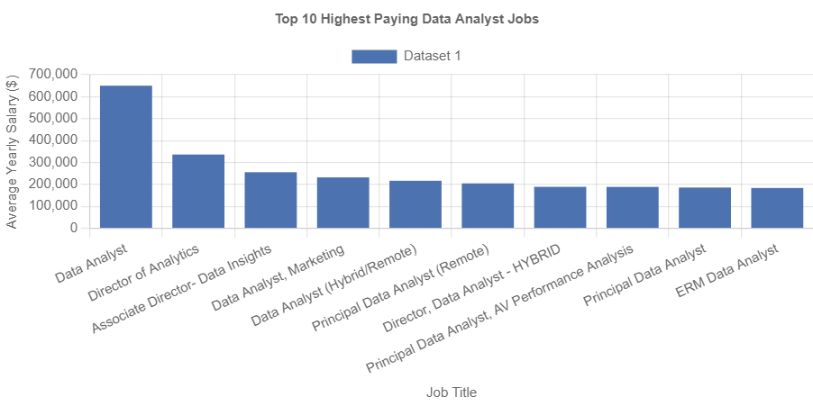
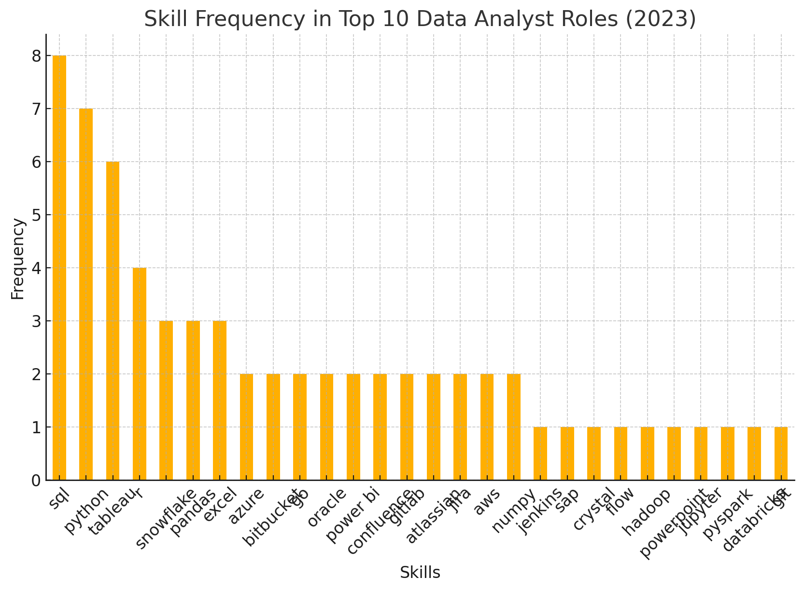
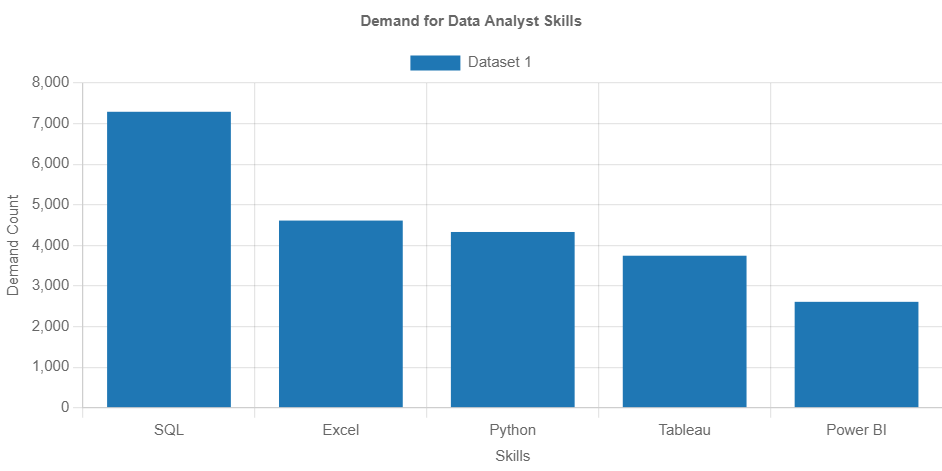

# Introduction

Dive into the data job market! Focusing on data analyst roles, this project explores top-paying jobs, in-demand skills and where high demand meets high salary in data analytics.

SQL queries? Check them out here: [project_sql folder](/project_sql/).

# Background

Driven by a quest to navigate the data analyst job market more effectively, this project was born from a desire to pinpoint top-paid and in-demand skills,streamlining others work to find optimal jobs.

Data used for this study is from [SQL Course](https://lukebarousse.com/sql). It's packed with insights on job titles, salaries, location and essential skills.

## Below are the questions I wanted to answer through the SQL queries:

1. What are the top paying data analyst jobs?
2. What skills are required for these top-paying jobs?
3. What skills are most in demand for data analysts?
4. Which skills are associated with higher salaries?
5. What are the most optimal skills to learn?

# Tools I Used

For my deep dive into the data analysis job market, I harnessed the power of seveal key tools:

- **SQL**: the backbone of my analysis, allowing me to query the database and unearth critical insights.
- **PostgreSQL**: the chose database management system, ideal for handling the job posting data.
- **Visual Studio Code**: my go-to for database management and executing SQL queries.
- **Git and GitHub**: essential for version control and sharing my SQL script and analysis, ensuring collaboration and project tracking.

# The Analysis

Each query for this project aimed at investigating specific aspects of the data analyst job market. Here is how I approached each question:

## 1. Top Paying Data Analyst Jobs

To identify the highest-paying roles, I filtered data analyst positions by average yearly salary and location, focusing on remote jobs. This query highlights the high paying opportunities in the field.

```sql
SELECT
    job_id,
    job_title,
    job_location,
    job_schedule_type,
    salary_year_avg,
    job_posted_date,
    name AS company_name
FROM
    job_postings_fact
LEFT JOIN company_dim ON job_postings_fact.company_id = company_dim.company_id
WHERE
    job_title_short = 'Data Analyst' AND
    job_location = 'Anywhere' AND
    salary_year_avg IS NOT NULL
ORDER BY
    salary_year_avg DESC
LIMIT 10
```

Here is the breakdown of the top data analyst jobs in 2023:

- **Wide Salary Range:** Top 10 paying data analyst roles span from $184,000 to $650,000, indicating significant salary potential in the field.
- **Diverse Employers:** Companies like SmartAssets, Meta, and AT&T are among those offering high salaries,showing a broad interest across different industries.
- **Job Title Variety:** There is a high diversity in job titles, from Data Analyst to Director of Analytic, reflecting varies roles and specialization within data analytics.
  
  
  _Bar chart visualising the salary for the top 10 salaries for data analysts; Julius.ai generated this graph from my SQL query results_

  ## 2. Top Paying Data Analyst Job Skills

  To identify the highest paying job skills, I identified the top 10 highest-paying data analyst jobs that are located 'Anywhere' and have non-null average salaries. Then joins these jobs with their associated companies and skill sets, retrieving detailed information about each job and the required skills. The final results are ordered by the average salary in descending order.

```sql
WITH top_paying_jobs AS (
SELECT
    job_id,
    job_title,
    salary_year_avg,
    name AS company_name
FROM
    job_postings_fact
LEFT JOIN company_dim ON job_postings_fact.company_id = company_dim.company_id
WHERE
    job_title_short = 'Data Analyst' AND
    job_location = 'Anywhere' AND
    salary_year_avg IS NOT NULL
ORDER BY
    salary_year_avg DESC
LIMIT 25
)

SELECT *
FROM top_paying_jobs
INNER JOIN skills_job_dim ON top_paying_jobs.job_id = skills_job_dim.job_id
INNER JOIN skills_dim ON skills_job_dim.skill_id = skills_dim.skill_id
ORDER BY
    salary_year_avg;
```

Here's a summary of the insights from the data:

1. SQL and Python are the most frequently required skills, highlighting their importance in data analysis.
2. Other popular programming languages include R.
3. Azure and Databricks are common cloud technologies mentioned.
4. There is a diverse range of skills required, indicating that data analyst roles demand a broad skill set.



_Bar chart visualising the salary for the top 25 skills for data analysts; ChatGPT generated this graph from my SQL query results_

## 3. Top Skills in Demand

To identify the top demanded skills I filtered the top 5 most demanded skills for data analyst jobs that allow working from home. I came up with a query that counts the number of job postings requiring each skill and orders the results by the demand count in descending order, providing a list of the most sought-after skills for remote data analyst positions.

```sql
SELECT
    skills,
    COUNT(skills_job_dim.job_id) AS demand_count
FROM job_postings_fact
INNER JOIN skills_job_dim ON job_postings_fact.job_id = skills_job_dim.job_id
INNER JOIN skills_dim ON skills_job_dim.skill_id = skills_dim.skill_id

WHERE
    job_title_short = 'Data Analyst' AND
    job_work_from_home = TRUE
GROUP BY
    skills
ORDER BY
    demand_count DESC
LIMIT 5
```

**Analysis Summary**

- SQL is the most in-demand skill, accounting for over 32% of the total demand.
- Excel and Python follow, with significant demand as well.
- Power BI has the lowest demand among the listed skills.

#### Top 5 Most Demanded Skills for Remote Data Analyst Jobs

| Skills   | Demand Count |
| -------- | ------------ |
| SQL      | 7291         |
| Excel    | 4611         |
| Python   | 4330         |
| Tableau  | 3745         |
| Power BI | 2609         |



_Bar chart visualising the top 5 in-demand skills for remote data analysts jobs; Julius.ai generated this graph from my SQL query results_

## 4. Top Paying Skills

I identified the top 25 skills associated with the highest average salaries for remote data analyst jobs. The query calculates the average salary for each skill, filters for relevant jobs, and orders the skills by their average salary in descending order. This provides a list of the most lucrative skills for remote data analyst positions.

```sql
SELECT
    skills,
    ROUND (AVG(salary_year_avg), 0) AS avg_salary
FROM job_postings_fact
INNER JOIN skills_job_dim ON job_postings_fact.job_id = skills_job_dim.job_id
INNER JOIN skills_dim ON skills_job_dim.skill_id = skills_dim.skill_id

WHERE
    job_title_short = 'Data Analyst'
    AND salary_year_avg IS NOT NULL
    AND job_work_from_home = TRUE
GROUP BY
    skills
ORDER BY
    avg_salary DESC
LIMIT 25
```

**Here is the summary of the data analytical output**
The data shows a wide range of salaries, with PySpark being the highest-paid skill and MicroStrategy the lowest among these top 25. The average salary across all skills is $143,380.08.

#### Top 25 Skills with Highest Average Salaries for Remote Data Analyst Jobs

| Skills        | Average Salary ($) |
| ------------- | ------------------ |
| PySpark       | 208,172            |
| Bitbucket     | 189,155            |
| Couchbase     | 160,515            |
| Watson        | 160,515            |
| DataRobot     | 155,486            |
| GitLab        | 154,500            |
| Swift         | 153,750            |
| Jupyter       | 152,777            |
| Pandas        | 151,821            |
| Elasticsearch | 145,000            |
| Golang        | 145,000            |
| Numpy         | 143,513            |
| Databricks    | 141,907            |
| Linux         | 136,508            |
| Kubernetes    | 132,500            |
| Atlassian     | 131,162            |
| Twilio        | 127,000            |
| Airflow       | 126,103            |
| Scikit-learn  | 125,781            |
| Jenkins       | 125,436            |
| Notion        | 125,000            |
| Scala         | 124,903            |
| PostgreSQL    | 123,879            |
| GCP           | 122,500            |
| MicroStrategy | 121,619            |

## 5. Optimal Skills

The query identifies the top 25 skills in terms of average salary for remote data analyst jobs, provided the skill is associated with more than 10 job postings. It calculates the average salary and demand count for each skill, filters for relevant jobs, and orders the skills by their average salary and demand count in descending order.

```sql
WITH skills_demand AS (
    SELECT
        skills_dim.skill_id,
        skills_dim.skills,
        COUNT(skills_job_dim.job_id) AS demand_count
    FROM job_postings_fact
    INNER JOIN skills_job_dim ON job_postings_fact.job_id = skills_job_dim.job_id
    INNER JOIN skills_dim ON skills_job_dim.skill_id = skills_dim.skill_id

    WHERE
        job_title_short = 'Data Analyst'
        AND salary_year_avg IS NOT NULL
        AND job_work_from_home = True
    GROUP BY
        skills_dim.skill_id
), average_salary AS (
    SELECT
        skills_job_dim.skill_id,
        -- skills_dim.skills,
        ROUND (AVG(job_postings_fact.salary_year_avg), 0) AS avg_salary
    FROM job_postings_fact
    INNER JOIN skills_job_dim ON job_postings_fact.job_id = skills_job_dim.job_id
    INNER JOIN skills_dim ON skills_job_dim.skill_id = skills_dim.skill_id

    WHERE
        job_title_short = 'Data Analyst'
        AND salary_year_avg IS NOT NULL
        AND job_work_from_home = TRUE
    GROUP BY
        skills_job_dim.skill_id
)

SELECT
    skills_demand.skill_id,
    skills_demand.skills,
    demand_count,
    avg_salary
FROM
    skills_demand
-- INNER JOIN average_salary ON skills_demand.skill_id
INNER JOIN average_salary ON skills_demand.skill_id = average_salary.skill_id
WHERE
    demand_count > 10
ORDER BY
    avg_salary DESC,
    demand_count DESC
LIMIT 25;

-- Rewriting the above query in a more concise and optimised form.
SELECT
    sd.skill_id,
    sd.skills,
    COUNT(sj.job_id) AS demand_count,
    ROUND(AVG(jp.salary_year_avg), 0) AS avg_salary
FROM
    job_postings_fact jp
INNER JOIN
    skills_job_dim sj ON jp.job_id = sj.job_id
INNER JOIN
    skills_dim sd ON sj.skill_id = sd.skill_id
WHERE
    jp.job_title_short = 'Data Analyst'
    AND jp.salary_year_avg IS NOT NULL
    AND jp.job_work_from_home = TRUE
GROUP BY
    sd.skill_id, sd.skills
HAVING
    COUNT(sj.job_id) > 10
ORDER BY
    avg_salary DESC,
    demand_count DESC
LIMIT 25;
```

**Analysis Summary:**

- High-Paying Skills: Skills like "go", "confluence", and "hadoop" offer the highest average salaries but have relatively lower demand.
- High-Demand Skills: "Python" and "tableau" are the most demanded skills with average salaries just above $100,000.
- Balanced Skills: Skills like "looker" and "sas" offer a good balance between demand and salary, making them attractive for remote data analyst jobs.

## Top 25 Skills with Highest Average Salaries for Remote Data Analyst Jobs

| Skill      | Demand Count | Average Salary ($) |
| ---------- | ------------ | ------------------ |
| Go         | 27           | 115,320            |
| Confluence | 11           | 114,210            |
| Hadoop     | 22           | 113,193            |
| Snowflake  | 37           | 112,948            |
| Azure      | 34           | 111,225            |
| BigQuery   | 13           | 109,654            |
| AWS        | 32           | 108,317            |
| Java       | 17           | 106,906            |
| SSIS       | 12           | 106,683            |
| Jira       | 20           | 104,918            |
| Oracle     | 37           | 104,534            |
| Looker     | 49           | 103,795            |
| NoSQL      | 13           | 101,414            |
| Python     | 236          | 101,397            |
| R          | 148          | 100,499            |
| Redshift   | 16           | 99,936             |
| Qlik       | 13           | 99,631             |
| Tableau    | 230          | 99,288             |
| SSRS       | 14           | 99,171             |
| Spark      | 13           | 99,077             |
| C++        | 11           | 98,958             |
| SAS        | 63           | 98,902             |
| SAS        | 63           | 98,902             |
| SQL Server | 35           | 97,786             |
| JavaScript | 20           | 97,587             |

# What I learnt

Throughout this adventurous study, I've turbocharged SQL toolkit with some serious firepower:

- **ComplexQuery Crafting:** mastered the art of advanced SQL, merging tables like a pro and wielding WITH clauses for ninja-level temp table maneuvers.
- **Data Aggregation:** got cozy with **GROUP BY** and turned aggregate funtions like **COUNT()** and **AVG()** into my data-summarizing sidekicks.
- **Analytical Wizadry:** Lveled up my real-world puzzle-solving skills, turning questions into actionable, insightful SQL queries.

# Conclusion

### Insights

From the analysis,several general insights emerged:

1. **Top-Paying Data Analysis Jobs:** the highest-paying jobs for data analysts that allow remote work offer a wide range of salaries, the highest at $650,000!
2. **Skills for Top-Paying Jobs:** high-payng data analyst jobs require advanced proficiency in SQL, suggesting it's a critical skill for earning a top salary.
3. **Most In-Demand Skills:** SQL is also the most demanded skill in the data analyst job market, thus making it essential for job seekers.
4. **Skills with Higher Salaries:** specialised skills, such as SVN and Solidity, are associated with the highes average salaries, indication a premium on niche expertise.
5. **Optimal Skills for Job Market Value:** SQL leads in demand and offers for a high average salary, positioning it as one of the most optimal skillls for data analyst to learn to maximise their market value.

### Closing Thoughts

This project enhanced my SQL skills and provided valuable insights into the data analyst job market. The findings frmo the analysis serve as a guide to prioritising skill development and job search efforts. Aspiring data analysts can better position themselves in a competitive job market by focusing on high-deman, high-salary skills. This exploration highlights theimportance of continuous learning and adaptaion toemerfing trends in the field of data analytics.
